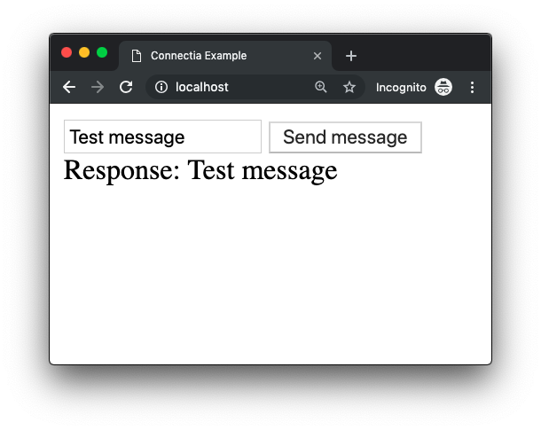

# Connectia, Simple & Lightweight ajax framework for nodeJS.

## Usage, Client

For client side, provide Connectia.js in the ```<head>``` of your document:
```html
<script src="https://connectia.ygstr.com/public/Connectia.js"></script>
```


Then for your javascript, connect to the node server with a new instance of Connectia:
```js
// Create new connectia instance
var con = new Connectia();

// Emit a login example
con.emit("login", {
    username: username,
    password: password
})

// Example on event
con.on("login_success", res => {
    console.log("Logged in as " + res.username)
})
```

## Usage, Server

Checkout index.js to see a full example of an express server with Connectia.

```js
const Connectia = require("./Connectia.js")
// Create new instance of Connectia, provide app from your express server
// See full example in index.js
const con = new Connectia(app);

/* Example code */
con.on("login", (message, emit) => {
    // Get user info from mysql for example
    var user = getUser(message.username)
    // Send information to the client
    emit("login_success", {
        username: message.username
    })
})
```

## Example build

The example server is index.js, and the example client is /public

1. Clone this repo to your computer.
2. run ```$ npm install``` to download all dependencies.
3. run ```$ node index.js``` to start the server on port 80
4. Visit localhost in your browser.



## Installation
### Server
1. Install body parser and express ```$ npm install body-parser express ```
2. Setup an express server (see index.js for a great example)
3. Download [Connectia.js](https://connectia.ygstr.com/Connectia.js) and require it (see examples above)

### Client
1. Link client version of Connectia in the ```<head>```, ```<script src="https://connectia.ygstr.com/public/Connectia.js"></script>```
2. Create a new instance of it,  ```var con = new Connectia()```
